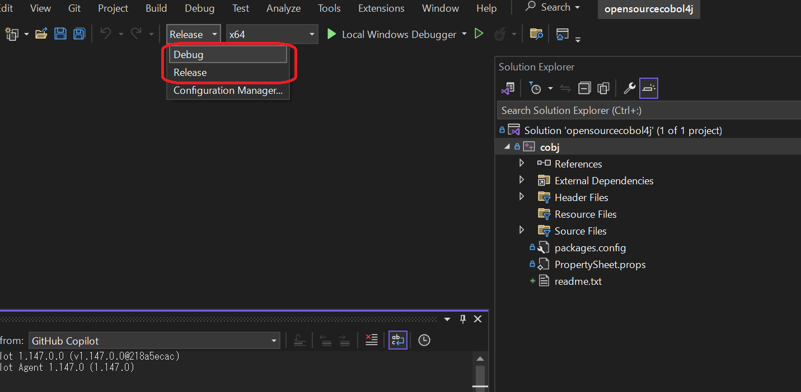
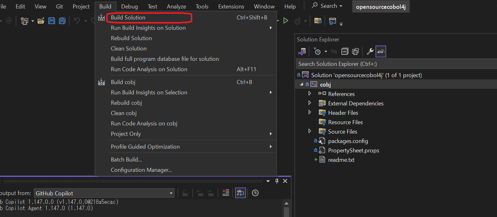

# opensource COBOL 4J

[日本語版README](./README_JP.md)

"opensource COBOL 4J" is a COBOL compiler that translates COBOL programs to Java programs.
This compiler is deeply inspired by ["opensource COBOL"](https://github.com/opensourcecobol/opensource-cobol) which translates COBOL programs to C programs.
(In fact, this repository contains a lot of source files of ["opensource COBOL"](https://github.com/opensourcecobol/opensource-cobol))

[CHANGELOG.md](./CHANGELOG.md) contains all notable changes.

## LICENSE

libcobj, the runtime libraries, are distributed under the the GNU Lesser General Public License Version 3.
Other software and libraries are distributed under the GNU GENERAL PUBLIC LICENSE Version 3.

## Requirements

opensource COBOL 4J is tested with the following platforms and dependencies

* Ubuntu 24.04 and OpenJDK 21
* AlmaLinux 9 and OpenJDK 11
* Amazon Linux 2023 and OpenJDK 21

In order to check requirements of older versions,
see [doc/requirements-all.md](./doc/requirements-all.md).

## Installation (Linux)

### Install dependencies

Run the following commands.

#### Ubuntu 24.04

```
sudo apt-get update
sudo apt-get install -y default-jdk build-essential bison flex gettext texinfo libgmp-dev autoconf
```

#### AlmaLinux 9

```
dnf -y update
dnf install -y java-11-openjdk-devel gcc make bison flex automake autoconf diffutils gettext
```

#### Amazon Linux 2023

```
dnf -y update
dnf install -y java-21-amazon-corretto-devel gcc make bison flex automake autoconf diffutils gettext tar gzip
```

### Install opensource COBOL 4J
```
curl -L -o opensourcecobol4j-v1.1.0.tar.gz https://github.com/opensourcecobol/opensourcecobol4j/archive/refs/tags/v1.1.0.tar.gz
tar zxvf opensourcecobol4j-v1.1.0.tar.gz
cd opensourcecobol4j-1.1.0
./configure --prefix=/usr/
make
sudo make install
```

### Set $CLASSPATH
Add /usr/lib/opensourcecobol4j/libcobj.jar to the environment variable $CLASSPATH.

In order to check installations of older versions,
[doc/installation/](./doc/installation) directory respectively


## Installation (Windows)
### Install Visual Studio
The Windows version of opensource COBOL 4J uses the CL compiler included in Visual Studio. Therefore, please install [Visual Studio](https://visualstudio.microsoft.com/) first.


### Build a solution file
1. Download the complete set of files for open source COBOL 4J.
2.  Open win/opensourcecobol4j.sln using Visual Studio.
3. Select "Debug" or "Release" mode.

4. Click "Build" -> "Build Solution".

Upon completion of the build, "cobj.exe" will be created in `win/x64/Debug` or `win/x64/Release`.

### Build Java Files
1. Install JDK.  
https://www.oracle.com/java/technologies/downloads/?er=221886#java8-windows
2. Open PowerShell.
3. Move to "libcobj" directory and execute `./gradlew shadowJar`
  
This will create libcobj.jar in `libcobj/app/build/libs/`.

### Place files in the appropriate location
1. If you build in Debug mode, change the 5th line of win/make-install.ps1 from `\x64\Release\cobj.exe` to `\x64\Debug\cobj.exe`.
2. Open PowerShell
3. Move to "win" directory and execute make-install.ps1.  

* The files will be placed in the following locations respectively. 
*  If you want to change the placement location of the files, modify make-install.ps1.

| Files name | Location |
|---|---|
| cobj.exe | C:\opensourcecobol4j\bin |
| libcobj.jar | C:\opensourcecobol4j\lib |
| config files | C:\opensourcecobol4j\config |

### Set the environment variables
1. Add C:\opensourcecobol4j\bin to the PATH environment variable.
2. Add C:\opensourcecobol4j\lib\libcobj.jar to the CLASSPATH environment variable.


## Install with Docker

The docker container for opensource COBOL 4J is available.

```bash
docker pull opensourcecobol/opensourcecobol4j:1.1.0
```

Execute the following commands in order to run the "Hello World" COBOL program.

``` bash
# Move to the sample directory
$ cd /root/cobol_sample

# Translate COBOL to Java and compile the Java source file.
$ cobj HELLO.cbl

# Run "Hello World"
$ java HELLO
HELLO WORLD!
```
## Usage

Compile.
```bash
cobj [COBOL source file]
```
("cobj" command produces [PROGRAM-ID].java and [PROGRAM-ID].class in the current directory.)

Run.
```bash
java [PROGRAM-ID]
```

## The progress of the development


Implemented.

* Data calculation (MOVE, COMPUTE, ... )
* Control statements (IF, PERFORM, GO TO, ...)
* Some I/O functions (DISPLAY, ACCEPT, ...)
* Call statements
* Sequential files
* Indexed files
* Relative files
* Sort statements
* Embedded functions (ACOS, LENGTH, MAX, ...)

## The status of NIST85 test

opensource COBOL 4J is tested using [NIST COBOL85 test suite](https://www.itl.nist.gov/div897/ctg/cobol_form.htm)

The result of NIST COBOL85 main test suites

```
------ Directory Information -------   --- Total Tests Information ---
Module Programs Executed Error Crash   Pass Fail Deleted Inspect Total
------ -------- -------- ----- -----  ----- ---- ------- ------- -----
NC           90       90     0     0   4352    0       6      11  4369   COBOL nucleus tests
SM           15       15     0     0    290    0       3       1   294   COPY sentence tests
IC           13       13     0     0     97    0       0       0    97   CALL sentence tests
SQ           81       81     0     0    512    0       6      81   599   Sequential file I-O tests
IX           39       39     0     0    507    0       1       0   508   Indexed file I-O tests
ST           39       39     0     0    278    0       0       0   278   SORT sentence tests
SG            5        5     0     0    193    0       0       0   193   Segment tests
OB            5        5     0     0     16    0       0       0    16   Obsolete facilities tests
IF           42       42     0     0    732    0       0       0   732   Intrinsic Function tests
RL           32       32     0     0   1827    0       5       0  1832   Relative file I-O tests
------ -------- -------- ----- -----  ----- ---- ------- ------- -----
Total       361      361     0     0   8804    0      21      93  8918
```

The result of nist cobol85 extra test suites

```
------ directory information -------   --- total tests information ---
module programs executed error crash   pass fail deleted inspect total
------ -------- -------- ----- -----  ----- ---- ------- ------- -----
cm            7        0     7     0      0    0       0       0     0   COMMUNICATION SECTION tests
db           10        0    10     0      0    0       0       0     0   Debugging facilities tests
rw            4        0     4     0      0    0       0       0     0   REPORT SECTION tests
------ -------- -------- ----- -----  ----- ---- ------- ------- -----
total        21        0    21     0      0    0       0       0     0
```

## cobj-idx
`cobj-idx`, a utility for indexed files, is also installed when installing opensource COBOL 4J.

```
cobj-idx - A utility tool to handle an indexed file of opensource COBOL 4J

Usage:
cobj-idx <sub command> [options] <indexed file>

Sub commands:

cobj-idx info <indexed-file>
    Show information of the indexed file.

cobj-idx load <indexed file>
    Load the data from stdin into the indexed file.
    The default format of the input data is SQUENTIAL of COBOL.

cobj-idx load <indexed file> <input file>
    Load data from the input fiile into the indexed file.
    The default format of the input data is SQUENTIAL of COBOL.

cobj-idx unload <indexed file>
    Write the records stored in the indexed file into stdout.
    The default format of the output data is SEQUENTIAL of COBOL.

cobj-idx unload <indexed file> <output file>
    Write the records stored in the indexed file into the output file.
    The default format of the output data is SEQUENTIAL of COBOL.

Options:

-f <format>, --format=<format>
    Specify the format of the input and output data.
    Possible values are 'txt' and the default value 'bin'
    'bin' and 'txt' means SEQUENTIAL and LINE SEQUENTIAL respectively.
    When doing a `load`, this option specifies the format of input data which will be inserted to an indexed file.
    When doing an `unload`, this option specifies the format of output data which will be read from an indexed file.

-h --help
    Print this message.

-n, --new
    Delete all data before inserting new data. This option is only valid when the sub command is 'load'.

-v, --version
    Print the version of cobj-idx.
```

## cobj-api
With `cobj-api`, you can easily generate an Spring boot Java file that calls the program generated by `cobj`.

```
Usage: cobj-api [options] <json-file>

Arguments:
  <json-file>: a json file generated by cobj with `-info-json-dir` option

Options:
  -h, --help                            Display this message
  -java-package=<package name>          Specify the package name of the generated source code
  -o=<dir>, --output-dir=<dir>          Set the output destination of the java file to an arbitrary destination
  -v, --version                         Prints the version of the cobj-api
```

## Contributing

Guidelines for contributing to opensource COBOL 4J can be found in [CONTRIBUTING.md](./CONTRIBUTING.md).
Contributors are listed in https://github.com/opensourcecobol/opensourcecobol4j/graphs/contributors
