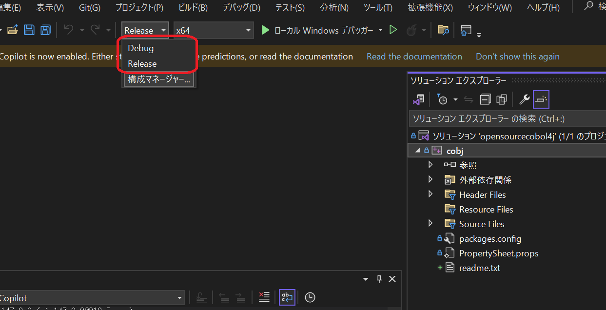
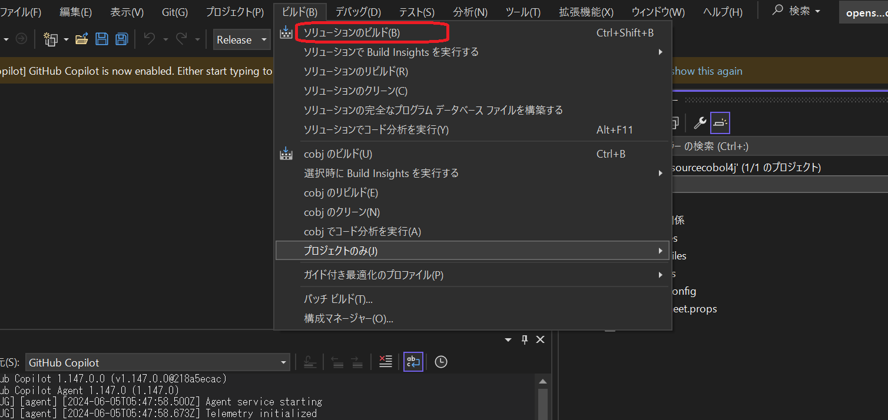

# opensource COBOL 4J

[English version README](./README.md)

"opensource COBOL 4J"は、COBOLソースコードをJavaソースコードに変換するCOBOLコンパイラです。
"opensource COBOL 4J"は、COBOLからCソースコードに変換するCOBOLコンパイラ["opensource COBOL"](https://github.com/opensourcecobol/opensource-cobol)をもとに開発されています。
（実際、このリポジトリには多くの["opensource COBOL"](https://github.com/opensourcecobol/opensource-cobol)のソースファイルが含まれています。）

変更履歴は[CHANGELOG.md](./CHANGELOG.md)をご覧ください。

## ライセンス
ランタイムライブラリであるlibcobjはLGPL 3、それ以外のソフトウェアやライブラリはGPL 3の下で配布されています。

## 動作環境
opensource COBOL 4Jは、下記の環境でテストされています：

* Ubuntu 24.04 と OpenJDK 21
* AlmaLinux 9 と OpenJDK 11
* Amazon Linux 2023 と OpenJDK 21

古いバージョンの動作環境については、[doc/requirements-all.md](./doc/requirements-all.md)をご覧ください。


## インストール(Linux)

### 依存ライブラリのインストール
下記のコマンドを実行します。

#### Ubuntu 24.04
```
sudo apt-get update
sudo apt-get install -y default-jdk build-essential bison flex gettext texinfo libgmp-dev autoconf
```

#### AlmaLinux 9
```
dnf -y update
dnf install -y java-11-openjdk-devel gcc make bison flex automake autoconf diffutils gettext
```

#### Amazon Linux 2023
```
dnf -y update
dnf install -y java-21-amazon-corretto-devel gcc make bison flex automake autoconf diffutils gettext tar gzip
```

### opensource COBOL 4Jのインストール
```
curl -L -o opensourcecobol4j-v1.1.2.tar.gz https://github.com/opensourcecobol/opensourcecobol4j/archive/refs/tags/v1.1.2.tar.gz
tar zxvf opensourcecobol4j-v1.1.2.tar.gz
cd opensourcecobol4j-1.1.2
./configure --prefix=/usr/
make
sudo make install
```

### $CLASSPATHの設定
/usr/lib/opensourcecobol4j/libcobj.jarを環境変数$CLASSPATHに追加します。
例えば、Unix系システムで次のコードを実行します。

```bash
export CLASSPATH="$CLASSPATH:/usr/lib/opensourcecobol4j/libcobj.jar"
```

古いバージョンのインストール方法は、[doc/installation_jp](./doc/installation_jp)をご覧ください。

## インストール (Windows)
### Visual Studioのインストール
Windows版のopensource COBOL 4JはVisual Studioに含まれるCLコンパイラを使用します。
そのため、まずは[Visual Studio](https://visualstudio.microsoft.com/)をインストールする必要があります。

### ソリューションファイルのビルド
1. opensource COBOL 4Jのファイル一式をダウンロードする。
2. Visual Studioでwin/opensourcecobol4j.slnを開く。
3. ”Debug”または”Release”モードを選択する。
    
4. ”ビルド” -> ”ソリューションのビルド” を選択する。
    
    ビルドが完了すると、`win/x64/Debug`または`win/x64/Release`に"cobj.exe"が作成される。

### Javaファイルのビルド
1. JDKをインストールする。
    https://www.oracle.com/java/technologies/downloads/?er=221886#java8-windows
2. PowerShellを開く。
3. "libcobj"ディレクトリに移動し、`.\gradlew shadowJar`を実行する。
    ```
    cd libcobj
    .\gradlew shadowJar
    ```
    これにより、`libcobj\app\build\libs\`に"libcobj.jar"が作成される。

### ファイルを適切な位置に配置
1. Debugモードでビルドした場合、`win/make-install.ps1`の5行目を`\x64\Release\cobj.exe`から`\x64\Debug\cobj.exe`に変更する。
2. PowerShellを開く。
3. ”win”ディレクトリに移動し、`make-install.ps1`を実行する。
    ```
    cd win
    .\make-install.ps1
    ```
* 各ファイルは以下の場所に配置されます。
    | ファイル名 | 配置場所 |
    |---|---|
    | cobj.exe | C:\opensourcecobol4j\bin |
    | libcobj.jar | C:\opensourcecobol4j\lib |
    | configファイル | C:\opensourcecobol4j\config |

* ファイルの配置場所を変更したい場合は、`make-install.ps1`に記載してあるパスを編集してください。

### 環境変数の設定
1. `C:\opensourcecobol4j\bin`を環境変数PATHに追加する。
2. `C:\opensourcecobol4j\lib\libcobj.jar`を環境変数CLASSPATHに追加する。

## Dockerを使ったインストール
opensource COBOL 4JのDockerコンテナを利用できます。

```bash
docker pull opensourcecobol/opensourcecobol4j:1.1.2
```

以下のコマンドを実行して、"Hello World"のCOBOLプログラムを実行します。

``` bash
# サンプルディレクトリに移動
$ cd /root/cobol_sample

# COBOLをJavaに変換し、Javaソースファイルをコンパイル
$ cobj HELLO.cbl

# "Hello World"を実行
$ java HELLO
HELLO WORLD!
```

## 使い方
コンパイルします。
```bash
cobj [COBOL source file]
```
(cobjコマンドにより、カレントディレクトリに[PROGRAM-ID].javaと[PROGRAM-ID].classが生成されます。)

実行します。
```bash
java [PROGRAM-ID]
```

## ドキュメント

* [ランタイムライブラリ`libcobj.jar`のAPIリファレンス](https://opensourcecobol.github.io/opensourcecobol4j/javadoc/libcobj/index.html)
* [opensource COBOL 4J: Java変換解説](./doc/converted_Java_file_JP.md)

## 実装状況
実装済み機能：
* 基本的なデータ操作 (MOVE, COMPUTEなど)
* 制御文 (IF, PERFORM, GO TOなど)
* 一部のI/O機能 (DISPLAY, ACCEPTなど)
* CALLによる呼び出し
* SEQUENTIALファイルの入出力機能
* RELATIVEファイルの入出力機能
* INDEXEDファイルの入出力機能
* SORT文
* 組み込み関数 (ACOS, LENGTH, MAXなど)

## NIST85テストの状況
opensource COBOL 4Jは[NIST COBOL85 test suite](https://www.itl.nist.gov/div897/ctg/cobol_form.htm)によりテストされています。

主要テスト結果：

```
------ Directory Information -------   --- Total Tests Information ---
Module Programs Executed Error Crash   Pass Fail Deleted Inspect Total
------ -------- -------- ----- -----  ----- ---- ------- ------- -----
NC           90       90     0     0   4352    0       6      11  4369   COBOLの中核機能のテスト
SM           15       15     0     0    290    0       3       1   294   COPY句のテスト
IC           13       13     0     0     97    0       0       0    97   CALL文のテスト
SQ           81       81     0     0    512    0       6      81   599   Sequentialファイルの入出力テスト
IX           39       39     0     0    507    0       1       0   508   Indexedファイルの入出力テスト
ST           39       39     0     0    278    0       0       0   278   SORT文のテスト
SG            5        5     0     0    193    0       0       0   193   セグメントのテスト
OB            5        5     0     0     16    0       0       0    16   廃止された機能のテスト
IF           42       42     0     0    732    0       0       0   732   組み込み関数のテスト
RL           32       32     0     0   1827    0       5       0  1832   Relativeファイルの入出力テスト
------ -------- -------- ----- -----  ----- ---- ------- ------- -----
Total       361      361     0     0   8804    0      21      93  8918
```

追加テストの結果：

```
------ directory information -------   --- total tests information ---
module programs executed error crash   pass fail deleted inspect total
------ -------- -------- ----- -----  ----- ---- ------- ------- -----
cm            7        0     7     0      0    0       0       0     0   COMMUNICATION SECTIONのテスト
db           10        0    10     0      0    0       0       0     0   Debugging機能のテスト
rw            4        0     4     0      0    0       0       0     0   REPORT SECTIONのテスト
------ -------- -------- ----- -----  ----- ---- ------- ------- -----
total        21        0    21     0      0    0       0       0     0
```
## cobj-idx
`cobj-idx`コマンドはINDEXEDファイルを扱うためのユーティリティで、opensource COBOL 4Jをインストールする際に、一緒にインストールされます。

```
cobj-idx - A utility tool to handle an indexed file of opensource COBOL 4J

Usage:
cobj-idx <sub command> [options] <indexed file>

Sub commands:

cobj-idx info <indexed-file>
    Show information of the indexed file.

cobj-idx load <indexed file>
    Load the data from stdin into the indexed file.
    The default format of the input data is SEQUENTIAL of COBOL.

cobj-idx load <indexed file> <input file>
    Load data from the input file into the indexed file.
    The default format of the input data is SEQUENTIAL of COBOL.

cobj-idx unload <indexed file>
    Write the records stored in the indexed file into stdout.
    The default format of the output data is SEQUENTIAL of COBOL.

cobj-idx unload <indexed file> <output file>
    Write the records stored in the indexed file into the output file.
    The default format of the output data is SEQUENTIAL of COBOL.

Options:

-f <format>, --format=<format>
    Specify the format of the input and output data.
    Possible values are 'txt' and the default value 'bin'
    'bin' and 'txt' means SEQUENTIAL and LINE SEQUENTIAL respectively.
    When doing a `load`, this option specifies the format of input data which will be inserted to an indexed file.
    When doing an `unload`, this option specifies the format of output data which will be read from an indexed file.

-h --help
    Print this message.

-n, --new
    Delete all data before inserting new data. This option is only valid when the sub command is 'load'.

-v, --version
    Print the version of cobj-idx.
```

## cobj-api
`cobj-api`コマンドを使用することで、`cobj`で生成されたプログラムを呼び出すSpring boot向けのJavaファイルを簡単に生成できます。

```
Usage: cobj-api [options] <json-file>

Arguments:
  <json-file>: a json file generated by cobj with `-info-json-dir` option

Options:
  -h, --help                            Display this message
  -java-package=<package name>          Specify the package name of the generated source code
  -o=<dir>, --output-dir=<dir>          Set the output destination of the java file to an arbitrary destination
  -v, --version                         Prints the version of the cobj-api
```
cobj-apiを用いたSpring Bootアプリケーションの作成方法については、[こちら](./doc/cobj-api_SpringBoot_JP.md)をご覧ください。

## コントリビューㇳ
コントリビュータ向けのガイドラインは[CONTRIBUTING_JP.md](./CONTRIBUTING_JP.md)を参照してください。
コントリビュータの一覧は https://github.com/opensourcecobol/opensourcecobol4j/graphs/contributors に掲載されています。
