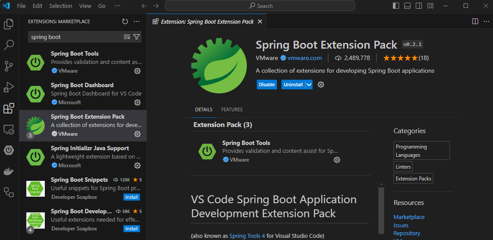
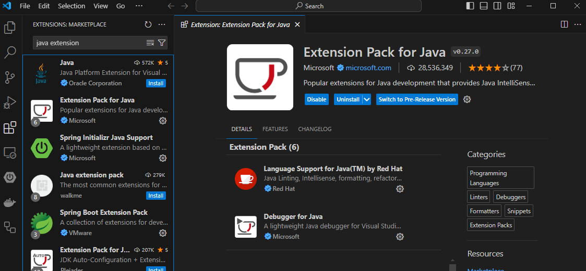
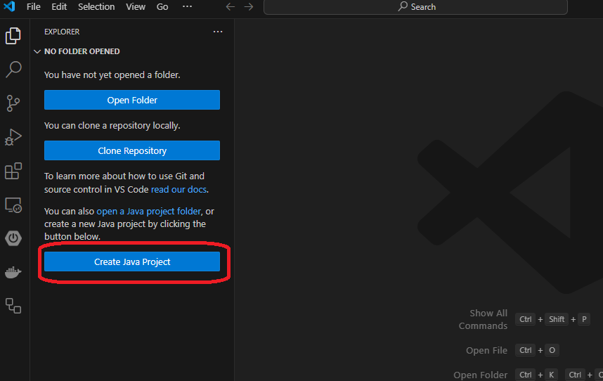
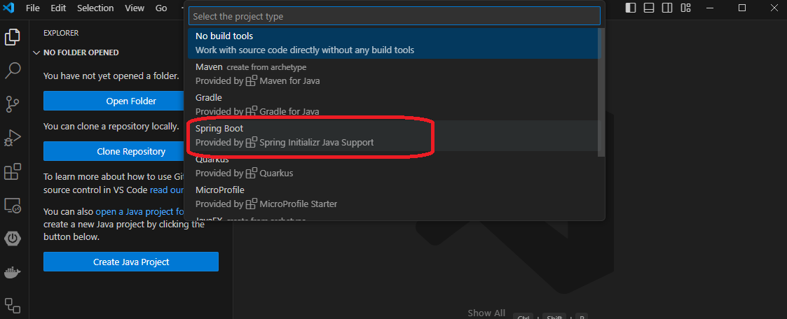
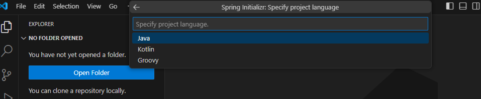
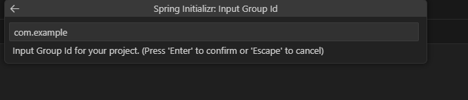
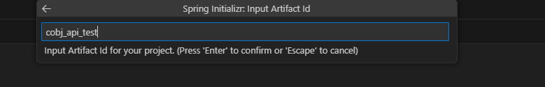
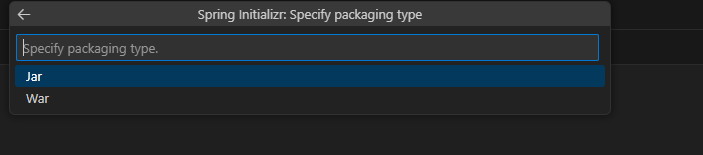
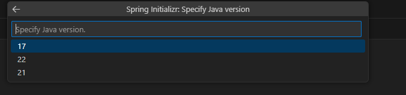

# Visual Studio Code を用いた Spring Bootプロジェクトの構築方法
1. Visual Studio Codeの拡張機能である、"Spring Boot Extension Pack"をインストールする.  


1. Visual Studio Codeの拡張機能である、"Java Extension Pack"をインストールする.  


1. 左側のサイドバーにある、"Explorer"を選択し、"Create Java Project"をクリックする。 


1. プロジェクトタイプはSpring Bootを選択する。 


1. ビルドツールをMavenかGradleから選択する。

1. Spring Bootのバージョンを選択する。

1. 使用言語はJavaを選択する。  


1. 任意の Group ID を入力する。この手順では、"com.example"を入力する。  


1. 任意の Artifact ID を入力する。この手順では、"cobj_api_test"を入力する。  


1. パッケージングタイプをJarかWarから選択する。

1. Javaのバージョンを選択する。

1. 依存するライブラリを選択する。この手順ではSpring Webのみを選択するが、必要に応じて他のライブラリを選択することもできる。  


1. プロジェクトを作成するディレクトリを選択し、enterを押す。  
上記の手順により、プロジェクトが作成される。  


# Spring Boot/cobj-api を用いたAPIの作成方法
1. `LINKAGE SECTION`が記述されたCOBOLプログラムを用意する。  
　本手順では下記のサンプルプログラムを使用する。

    sample.cbl
    ``` cobol
           IDENTIFICATION          DIVISION.
           PROGRAM-ID.             sample.
           ENVIRONMENT             DIVISION.
           CONFIGURATION           SECTION.
           DATA                    DIVISION.
           WORKING-STORAGE         SECTION.
           LINKAGE                 SECTION.
           01  DATA1               PIC 9(09).
           01  DATA2               PIC 9(09).
           01  DATA3               PIC 9(09).
           01  SUM-DATA            PIC 9(09).
           PROCEDURE               DIVISION
                                   USING  DATA1,
                                          DATA2,
                                          DATA3,
                                          SUM-DATA.
           MAIN-SECTION.
               ADD DATA1 DATA2 DATA3 TO SUM-DATA.
           GOBACK.

    ```

2. `cobj`コマンドでCOBOLプログラムからJSONファイルを生成する。
     ```
     cobj -info-json-dir=./ -java-package=com.example.cobj_api_test sample.cbl
     ```
   * `-info-json-dir`：COBOLプログラムからJSONファイルを生成するオプション。"="の後ろに生成先のディレクトリを指定する。
   * `-java-package`：生成されるJavaファイルのパッケージ名を指定するオプション。"="の後ろにパッケージ名を指定する。
    
    これにより、sample.java、info_sample.jsonが生成される。

    info_sample.jsonには、"LINKAGE SECTION"で定義された変数と、その型名が記述される。
    ```
    {
      "opensourcecobol4j_version": "1.1.1",
      "program_id": "sample",
      "procedure_division_using_parameters": [
        {
          "variable_name": "DATA1",
          "java_type": "int"
        },
        {
          "variable_name": "DATA2",
          "java_type": "int"
        },
        {
          "variable_name": "DATA3",
          "java_type": "int"
        },
        {
          "variable_name": "SUM-DATA",
          "java_type": "int"
        }
      ]
    }    
    ```
3. `cobj-api`コマンドで、JSONファイルからSpring Boot向けのJavaファイルを生成する。
   ```
    cobj-api -java-package=com.example.cobj_api_test info_sample.json
    ```
   * `-java-package`：生成されるJavaファイルのパッケージ名を指定するオプション。

    これにより、sampleController.java、sampleRecord.javaが生成される。
4. sample.java、sampleController.java、sampleRecord.javaを、作成したSpring Bootプロジェクトに配置する。
本手順では、"src/main/java/com/example/cobj_api_test"に配置する。

    ファイル構成：
    ```
    .
    ├── HELP.md
    ├── mvnw
    ├── mvnw.cmd
    ├── pom.xml
    ├── src
    │   ├── main
    │   │   ├── java
    │   │   │   └── com
    │   │   │       └── example
    │   │   │           └── cobj_api_test
    │   │   │               ├── CobjApiTestApplication.java
    │   │   │               ├── sample.java
    │   │   │               ├── sampleController.java
    │   │   │               └── sampleRecord.java
    │   │   └── resources
    │   └── test
    └── target
    ```


5. プロジェクトの任意の場所に、libcobj.jarを配置する。  
        ファイル構成：
    ```
    .
    ├── HELP.md
    |── lib
    |   └── libcobj.jar
    ├── mvnw
    ├── mvnw.cmd
    ├── pom.xml
    ├── src
    │   ├── main
    │   │   ├── java
    │   │   │   └── com
    │   │   │       └── example
    │   │   │           └── cobj_api_test
    │   │   │               ├── CobjApiTestApplication.java
    │   │   │               ├── sample.java
    │   │   │               ├── sampleController.java
    │   │   │               └── sampleRecord.java
    │   │   └── resources
    │   └── test
    └── target
    ```
    * libcobj.jarは、opensource COBOL 4Jをインストールすると、"opensourcecobol4j/libcobj/app/build/lib/"配下に生成されるjarファイルである。

6. 依存関係の追加
* Gradleの場合  
  build.gradleを以下のように修正する。
   ```
    dependencies {
        implementation files('lib/libcobj.jar')
        implementation('org.springframework.boot:spring-boot-starter-web') {
        exclude group: 'org.springframework.boot', module: 'spring-boot-starter-logging' 
        }
    }
    ```
    * "spring-boot-starter-web"は、これまでの手順によりデフォルトで追加されている依存関係である。
    * "spring-boot-starter-web"に含まれているプロバイダーが、libocbj.jarに含まれているプロバイダーと競合するため、`exclude group`で除外する必要がある。
* Mavenの場合  
pom.xmlに以下の依存関係を追加する。
    ```
    <dependency>
        	<groupId>libcobj</groupId>
			<artifactId>libcobj</artifactId>
			<version>1.1.0(cobjのバージョン)</version>
        	<scope>system</scope>
        	<systemPath>${basedir}/lib/libcobj.jar</systemPath>
    	</dependency>
    ```
7. Spring Bootプロジェクトをビルド及び起動する。
   プロジェクトのルートディレクトリで、以下のコマンドを実行する。
* Gradleの場合
    ```
    ./gradlew bootRun
    ``` 
* Mavenの場合
   ```
   mvn spring-boot:run
   ```

8. ブラウザで、`http://localhost:8080/<PROGRAM-ID>?<データ名1>=<データ値1>&<データ名2>=<データ値2>&...`にアクセスすることで、APIを呼び出すことができる。

   今回使用したサンプルプログラムの場合、`http://localhost:8080/sample?DATA1=1&DATA2=2&DATA3=3`にアクセスすると、下記のようなJSONが返される。
   ```
   {"statuscode":200,"DATA1":1,"DATA2":2,"DATA3":3,"SUM_DATA":6}
   ```
