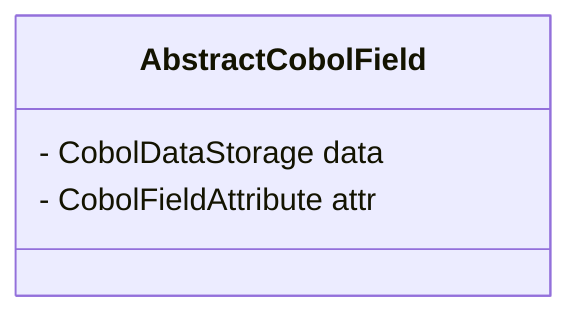
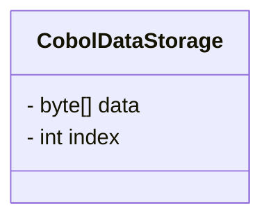

# opensource COBOL 4J: Java Conversion Guide

## Introduction

opensource COBOL 4J is a compiler that converts COBOL programs to Java programs for execution.
This document explains important aspects of how opensource COBOL 4J converts COBOL to Java.

## Variables and Group Items

Variables defined in COBOL are converted to instances of the AbstractCobolField class.
**Depending on the PICTURE clause, each variable is converted to a derived class of AbstractCobolField.**
For example, a variable with `PIC 9(5)` is converted to an instance of CobolNumericField class, and a variable with `PIC X(3)` is converted to CobolAlphanumericField.

Additionally, AbstractCobolField has a CobolDataStorage class that stores the actual data as a byte array, and a CobolFieldAttribute class that stores other information.



### CobolDataStorage Class



The CobolDataStorage class has a byte array data and an index that indicates the starting position of the data within the byte array.

```cobol
       WORKING-STORAGE  SECTION.
       01 REC.
         05 FIELD-A PIC X(10).
         05 FIELD-B PIC X(10).
```

For the variable definition above, group item functionality is implemented by generating code similar to the following.
Note that the code below is for explanation purposes and differs from the actually generated code.

```java
byte[] bytes = new byte[25];
// CobolDataStorage instance for group item REC.
// Holds byte array data with starting position 0
CobolDataStorage rec_storage = new CobolDataStorage(/* data= */ bytes, /* index= */ 0);
// CobolDataStorage instance for group item FIELD_A.
// Holds byte array data with starting position 0
CobolDataStorage field_a_storage = rec_storage.getSubDataStorage(/* data= */ bytes, /* index= */ 0);
// CobolDataStorage instance for group item FIELD_B.
// Holds byte array data with starting position 10
CobolDataStorage field_b_storage = rec_storage.getSubDataStorage(/* data= */ bytes, /* index= */ 10);
// CobolDataStorage instance for group item FIELD_C.
// Holds byte array data with starting position 15
CobolDataStorage field_b_storage = rec_storage.getSubDataStorage(/* data= */ bytes, /* index= */ 15);
```

### CobolFieldAttribute Class

The CobolFieldAttribute class is a class that holds various information about variables.
The information stored in the member variables of the CobolFieldAttribute class is as follows:
#### type
The type is a member variable that represents information such as string type, numeric type, and group item.
Depending on the value stored in type, a specific derived class of AbstractCobolField is used.

| Constant Name | Value | AbstractCobolField Derived Class | Description |
| --- | --- | --- | --- |
| COB_TYPE_UNKNOWN | 0x00 | None | Unused |
| COB_TYPE_GROUP |  0x01 | CobolGroupField | Group item |
| COB_TYPE_BOOLEAN | 0x02 | None | Unused |
| COB_TYPE_NUMERIC_DISPLAY | 0x10 | CobolNumericField | Numeric type (`PIC 9`, `PIC 99V9`, etc.) |
| COB_TYPE_NUMERIC_BINARY | 0x11 | CobolNumericBinaryField | Binary numeric type (`PIC 9 COMP`, `PIC 9 COMP-5`, etc.) |
| COB_TYPE_NUMERIC_PACKED | 0x12 | CobolNumericPackedField | Packed decimal (`PIC 9 COMP-3`) |
| COB_TYPE_NUMERIC_FLOAT | 0x13 | None | Indicates COMP-1 is specified. COMP-1 is not implemented. |
| COB_TYPE_NUMERIC_DOUBLE | 0x14 | None | Indicates COMP-2 is specified. COMP-2 is not implemented. |
| COB_TYPE_ALPHANUMERIC | 0x21 | CobolAlphanumericField | String type (`PIC X`, `PIC X(10)`, etc.) |
| COB_TYPE_ALPHANUMERIC_ALL | 0x22 | CobolAlphanumericAllField | Assigned to string constants (SPACE, etc.) |
| COB_TYPE_ALPHANUMERIC_EDITED | 0x23 | CobolAlphanumericEditedField | Alphanumeric edited item |
| COB_TYPE_NUMERIC_EDITED | 0x24 | CobolNumericEditedField | Numeric edited item |
| COB_TYPE_NATIONAL | 0x40 | CobolNationalField | Japanese type (`PIC N`, `PIC N(10)`, etc.) |
| COB_TYPE_NATIONAL_EDITED | 0x41 | CobolNationalEditedField | Japanese edited item |
| COB_TYPE_NATIONAL_ALL | 0x42 | CobolNationalAllField | Assigned to string constants (SPACE, etc.) for Japanese items |

#### digits
The digits is a member variable that represents the number of digits of a variable when used with numeric types like `PIC 9(5)`.
For example, if it's `PIC 9(5)`, digits stores 5, and if it's `PIC 9(3)V9(4)`, it stores 7.

#### scale
The scale is a member variable used to represent the position of the decimal point.
For example, with `PIC 9(5)`, `0` is stored, with `PIC 9(3)V9(4)`, `4` is stored, and with `PIC 9(3)PP`, `-2` is stored.

#### flag
The flag is a member variable used to store other information.
The value is stored in flag by calculating the bitwise OR of the values shown in the table below.

For example, consider the case of `PIC S9(5) SIGN LEADING SEPARATE`.
In this case, it matches three conditions from the table below: COB_FLAG_SIGN, COB_FLAG_SIGN_SEPARATE, and COB_FLAG_SIGN_LEADING, so 0x01 | 0x02 | 0x04 (=0x07) is stored in flag.

| Constant Name | Value | Description |
| --- | --- | --- |
| COB_FLAG_HAVE_SIGN | 0x01 | Indicates a signed numeric type such as `PIC S9`. |
| COB_FLAG_SIGN_SEPARATE | 0x02 | Indicates that sign separation is specified as in `PIC S9 SIGN TRAILING SEPARATE` or `PIC S9 SIGN LEADING SEPARATE`. |
| COB_FLAG_SIGN_LEADING | 0x04 | Indicates that the sign is stored at the beginning as in `PIC S9(2) SIGN LEADING`. |
| COB_FLAG_BLANK_ZERO | 0x08 | Indicates that BLANK WHEN ZERO is specified as in `PIC 9 BLANK WHEN ZERO`. |
| COB_FLAG_JUSTIFIED | 0x10 | Indicates that JUSTIFIED RIGHT is specified as in `PIC X(3) JUSTIFIED RIGHT`. |
| COB_FLAG_BINARY_SWAP | 0x20 | Indicates that one of COMP, COMP-4, or BINARY is specified. |
| COB_FLAG_REAL_BINARY | 0x40 | Indicates that one of SIGNED-SHORT, SIGNED-INT, SIGNED-LONG, UNSIGNED-SHORT, UNSIGNED-INT, or UNSIGNED-LONG is specified. |
| COB_FLAG_IS_POINTER | 0x80 | Indicates that POINTER is specified. POINTER is not implemented. |

#### pic

The pic is a member variable that holds the string written in the PICTURE clause, but null is stored if the compiler determines it's not necessary at runtime.

For edited items, data in a special format is stored.
For example, consider a numeric edited item with a PICTURE clause of `PIC ++9(3),9(2)`.
This PICTURE clause is a string of 8 characters: + for 2 characters, 9 for 3 characters, , for 1 character, and 9 for 2 characters, so pic stores:
"+<<<4-byte integer indicating 2>>>9<<<4-byte integer indicating 3>>>,<<<4-byte integer indicating 1>>>9<<<4-byte integer indicating 2>>>"

## PROCEDURE DIVISION

Each instruction in the PROCEDURE DIVISION is converted to a method call defined in libcobj.jar that corresponds to the instruction.
Below are examples of typical instruction conversions.

### DISPLAY Statement

The COBOL DISPLAY statement is converted to code that calls the display method of the CobolTerminal class.

```cobol
DISPLAY "HELLO".
```

```java
/* a.cbl:6: DISPLAY */
{
  CobolTerminal.display (0, 1, 1, c_1);
}
```

As shown above, each statement is enclosed in a block `{}`, with comments above indicating the original COBOL source code filename and line number, and the converted method call.

### Control Statements
IF statements and PERFORM VARYING statements are converted to Java if statements and for statements, respectively.

Here is an example of converting an IF statement.
```cobol
         IF 1 = 1 THEN
                DISPLAY "HELLO"
         ELSE
                DISPLAY "WORLD"
         END-IF.
```

```java
        /* a.cbl:6: IF */
        {
          if (((long)c_1.cmpInt (1) == 0L))
            {
              /* a.cbl:7: DISPLAY */
              {
                CobolTerminal.display (0, 1, 1, c_2);
              }
            }
          else
            {
              /* a.cbl:9: DISPLAY */
              {
                CobolTerminal.display (0, 1, 1, c_3);
              }
            }
        }
```

Here is an example of converting a PERFORM VARYING statement.

```cobol
       PERFORM VARYING C FROM 1 BY 1 UNTIL C > 5
           DISPLAY C
       END-PERFORM.
```

```java
for (;;)
  {
    if (((long)b_C.cmpNumdisp (1, 5) >  0L))
      break;
    {
      /* a.cbl:8: DISPLAY */
      {
        CobolTerminal.display (0, 1, 1, f_C);
      }
    }
    f_C.addInt (1);
  }
```

### CALL Statement

The CALL statement is also converted to a method call defined in libcobj.jar.

```cobol
       CALL "sub".
```

```java
/* a.cbl:6: CALL */
{
  CobolModule.getCurrentModule ().setParameters ();
  call_sub = CobolResolve.resolve("sub", call_sub);
  b_RETURN_CODE.set (call_sub.run ());
}
```

In opensource COBOL 4J, the module name specified in the CALL statement is resolved at runtime as a general rule.

## Overall Program Control Structure

In COBOL, the PROCEDURE DIVISION is divided by SECTIONs and PARAGRAPHs.
You can specify a divided part to call a process with a PERFORM statement or jump to a specific location with a GO TO statement.
This section explains how these features are implemented when converted to Java.
The details will be explained using the following program as an example.

```cobol
       IDENTIFICATION   DIVISION.
       PROGRAM-ID.      prog.
       DATA             DIVISION.
       WORKING-STORAGE  SECTION.
       PROCEDURE        DIVISION.
       MAIN SECTION.
           PERFORM A-01.
           PERFORM A-02.
           PERFORM SUB.
           GO TO LAST-PROC.
       SUB SECTION.
       A-01.
           DISPLAY "A-01 START".
           DISPLAY "A-01 END".
       A-02.
           DISPLAY "SECT-02".
       LAST-PROC SECTION.
       LAST-MESSAGE.
           DISPLAY "END".
```

In opensource COBOL 4J, processes divided by SECTIONs and PARAGRAPHs are extracted and converted into anonymous classes derived from the CobolControl class.
The converted anonymous classes are stored in an array of the CobolControl class in the order described in the PROCEDURE DIVISION.

```java
public CobolControl[] contList = {
    //...
    //...
    new CobolControl(l_MAIN_SECTION__DEFAULT_PARAGRAPH, CobolControl.LabelType.label) {
        // MAIN SECTION processing
        //...
    },
    new CobolControl(l_SUB, CobolControl.LabelType.section) {
        // SUB SECTION processing
        //...
    },
    new CobolControl(l_SUB__A_01, CobolControl.LabelType.label) {
        // A-01 processing
        //...
    },
    new CobolControl(l_SUB__A_01, CobolControl.LabelType.label) {
        // A-02 processing
        //...
    },
    new CobolControl(l_LAST_PROC, CobolControl.LabelType.section) {
        // LAST-PROC SECTION processing
        //...
    },
    new CobolControl(l_LAST_PROC__LAST_MESSAGE, CobolControl.LabelType.paragraph) {
        // LAST-MESSAGE processing
        //...
    }
}

```

For example, the A-01 process in the COBOL source code is converted as follows:

```java
new CobolControl(l_SUB__A_01, CobolControl.LabelType.label) {
  public Optional<CobolControl> run() throws CobolRuntimeException, CobolGoBackException, CobolStopRunException {
    /* prog.cbl:13: DISPLAY */
    {
      CobolTerminal.display (0, 1, 1, c_1);
    }
    /* prog.cbl:14: DISPLAY */
    {
      CobolTerminal.display (0, 1, 1, c_2);
    }

    return Optional.of(contList[l_SUB__A_02]);
  }
}
```

The A-02 process is converted as follows:

```java
new CobolControl(l_SUB__A_02, CobolControl.LabelType.label) {
  public Optional<CobolControl> run() throws CobolRuntimeException, CobolGoBackException, CobolStopRunException {
    /* prog.cbl:16: DISPLAY */
    {
      CobolTerminal.display (0, 1, 1, c_3);
    }

    return Optional.of(contList[l_LAST_PROC]);
  }
}
```

The CobolControl class is a class included in libcobj.jar, the runtime provided by opensource COBOL 4J.
The run method describes the actual process, and other necessary information is stored in member variables.

The processes in the PROCEDURE DIVISION are executed using the CobolControl array contList.

In opensource COBOL 4J, PERFORM and GO TO statements are implemented by calling methods that use the CobolControl class functions.
PERFORM and GO TO statements are converted to code that calls these methods.
```java
CobolControl.perform(contList, l_SUB__A_01).run();

CobolControl.perform(contList, l_SUB__A_02).run();

CobolControl.perform(contList, l_SUB).run();

{
  if(true) return Optional.of(contList[l_LAST_PROC          ]);

}
```

* Note: The Java compiler treats obviously unreachable code as an error. The `if(true)` in the code above is generated to avoid this compilation error.

## libcobj/ Description
libcobj.jar is the runtime for opensource COBOL 4J and is built from Java source code stored in `opensourcecobol4j/libcobj/src/jp/osscons/opensourcecobol/libcobj`.
An overview of these source codes is shown below.

### call directory
This section explains the source code stored in `opensourcecobol4j/libcobj/src/jp/osscons/opensourcecobol/libcobj/call`.
Classes related to the CALL statement are defined in this directory.

| File Name | Description |
| --- | --- |
| CobolCallDataContent.java | Class used for CALL statement invocation. |
| CobolResolve.java | Class that defines the process to dynamically load Java classes. |
| CobolRunnable.java | Interface that Java classes called by the CALL statement should implement. |
| CobolSystemRoutine.java | Class that implements some built-in functions. |

### common directory
This section explains the source code stored in `opensourcecobol4j/libcobj/src/jp/osscons/opensourcecobol/libcobj/common`.
Other classes are defined in this directory.

| File Name | Description |
| --- | --- |
| CobolCallParams.java | Unused class. |
| CobolCheck.java | Class that implements runtime check processes. |
| CobolConstant.java | Class that defines various constants. |
| CobolControl.java | Class that implements control structures such as sections and labels. |
| CobolExternal.java | Class for implementing the EXTERNAL clause. (Implementation is incomplete) |
| CobolFrame.java | Unused class. |
| CobolInspect.java | Class that implements functionality for the INSPECT statement. |
| CobolIntrinsic.java | Class that defines built-in functions. |
| CobolModule.java | Class that holds various information at runtime. |
| CobolString.java | Class that defines processes related to STRING and UNSTRING statements. |
| CobolUtil.java | Class that defines miscellaneous processes. |
| GetAbstractCobolField.java | Interface that implements the run method that returns AbstractCobolField. |
| GetInt.java | Interface that implements the run method that returns AbstractCobolField. |

### data directory
This section explains the source code stored in `opensourcecobol4j/libcobj/src/jp/osscons/opensourcecobol/libcobj/data`.
Classes related to variables used in COBOL programs are defined in this directory.

| File Name | Description |
| --- | --- |
| AbstractCobolField.java | Parent class for classes for COBOL variables. |
| CobolAlphanumericAllField.java | Class for string item constants. |
| CobolAlphanumericEditedField.java | Class for string edited items. |
| CobolAlphanumericField.java | Class for string items. |
| CobolDataStorage.java | Class that holds variable data as an array of byte type data. |
| CobolDecimal.java | Class used for numeric calculations. |
| CobolFieldAttribute.java | Class that holds various information about COBOL variables. |
| CobolFieldFactory.java | Class for dynamically generating instances of COBOL variables. |
| CobolGroupField.java | Class for group items. |
| CobolNationalAllField.java | Class for Japanese string constants. |
| CobolNationalEditedField.java | Class for Japanese edited items. |
| CobolNationalField.java | Class for Japanese items. |
| CobolNumericBinaryField.java | Class for COMP-5, etc. |
| CobolNumericDoubleField.java | Class for Java double type variables. |
| CobolNumericEditedField.java | Class for numeric edited items. |
| CobolNumericField.java | Class for numeric types. |
| CobolNumericPackedField.java | Class for COMP-3. |

### exceptions directory
This section explains the source code stored in `opensourcecobol4j/libcobj/src/jp/osscons/opensourcecobol/libcobj/exceptions`.
Classes representing exceptions that occur during the execution of COBOL programs are defined in this directory.

| File Name | Description |
| --- | --- |
| CobolExceptionId.java | Class that defines exception IDs. |
| CobolException.java | Parent class of classes that indicate exceptions. |
| CobolExceptionTabCode.java | Class that manages exception codes. |
| CobolGoBackException.java | Class for exceptions used during GO BACK execution. |
| CobolRuntimeException.java | Class related to runtime errors. |
| CobolStopRunException.java | Class for exceptions used during STOP RUN execution. |
| CobolUndefinedException.java | Unused class. |
| RuntimeErrorHandler.java | Interface for handlers when exceptions occur. |
| RuntimeExitHandler.java | Interface for handlers when programs end. |


### file directory
This section explains the source code stored in `opensourcecobol4j/libcobj/src/jp/osscons/opensourcecobol/libcobj/file`.
Classes related to files handled by COBOL programs are defined in this directory.

| File Name | Description |
| --- | --- |
| CobolFileFactory.java | Class that generates instances related to files. |
| CobolFile.java | Class that implements common processes related to files. |
| CobolFileKey.java | Class that implements processes related to file keys. |
| CobolFileSort.java | Class that implements sort processes. |
| CobolIndexedFile.java | Class that implements INDEXED files. |
| CobolItem.java | Class that holds information such as records.|
| CobolLineSequentialFile.java | Class that implements LINE SEQUENTIAL files.|
| CobolRelativeFile.java | Class that implements RELATIVE files. |
| CobolSequentialFile.java | Class that implements SEQUENTIAL and LINE SEQUENTIAL files. |
| CobolSort.java | Class that holds information related to SORT. |
| FileIO.java | Class used for input/output in files other than indexed files. |
| FileStruct.java | Class that holds information related to files. |
| IndexedCursor.java | Class used in indexed file processing. |
| IndexedFile.java | Class that holds information related to indexed files. |
| KeyComponent.java | Class related to file keys. |
| Linage.java | Class related to LINAGE. |
| MemoryStruct.java | Class used in sort processing. |

### termio directory
This section explains the source code stored in `opensourcecobol4j/libcobj/src/jp/osscons/opensourcecobol/libcobj/termio`.
Classes related to DISPLAY and ACCEPT statements are defined in this directory.

| File Name | Description |
| --- | --- |
| CobolTerminal.java | Class that defines processes related to DISPLAY and ACCEPT statements. |

### Top-level directory
This section explains the source code stored directly under `opensourcecobol4j/libcobj/src/jp/osscons/opensourcecobol/libcobj/`.

| File Name | Description |
| --- | --- |
| Const.java | Class that defines constants used within libcobj. |