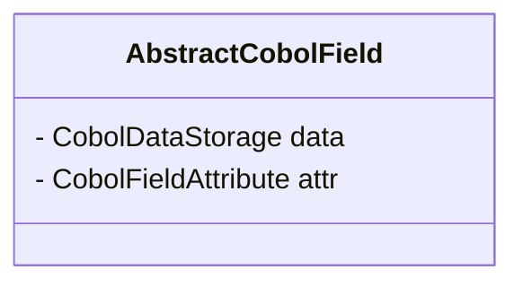
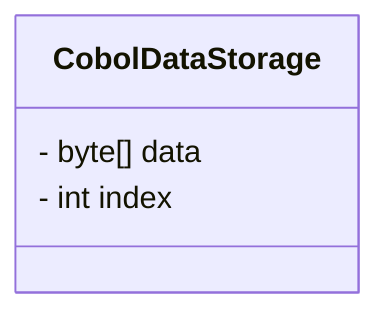

# opensource COBOL 4J: Java変換解説

## はじめに

opensource COBOL 4Jは、COBOLプログラムをJavaプログラムに変換して実行するコンパイラである。
本文書ではopensource COBOL 4JのCOBOLからJavaへの変換方法について、重要な箇所を解説する。

## 変数・集団項目

COBOLで定義された変数は、AbstractCobolFieldクラスのインスタンスへ変換される。
**PICTURE句に応じて、各変数はAbstractCobolFieldクラスの派生クラスへと変換される。**
例えば、`PIC 9(5)`の変数はCobolNumericFieldクラスのインスタンスへ変換され、`PIC X(3)`の変数はCobolAlphanumericFieldに変換される。

また、AbstractCobolFieldは実際のデータをバイト配列として保持するCobolDataStorageクラスと、その他の情報を格納するCobolFieldAttributeクラスを持つ。



### CobolDataStorageクラス



CobolDataStorageクラスはバイト配列dataと、そのバイト配列内でのデータの格納されている先頭位置を保持するindexを持つ。

```cobol
       WORKING-STORAGE  SECTION.
       01 REC.
         05 FIELD-A PIC X(10).
         05 FIELD-B PIC (5).
         05 FIELD-B PIC X(10).
```

上記の変数定義に対して、概ね下記のようなコードを生成することで、集団項目の機能を実現している。
ただし、下記は説明のためのコードであり、実際に生成されるコードとは異なることに注意すること。

```java
byte[] bytes = new byte[25];
// 集団項目RECに対応するCobolDataStorageクラスのインスタンス。
// バイト配列dataを保持し、データの開始位置は0
CobolDataStorage rec_storage = new CobolDataStorage(/* data= */ bytes, /* index= */ 0);
// 集団項目FIELD_Aに対応するCobolDataStorageクラスのインスタンス。
// バイト配列dataを保持し、データの開始位置は0
CobolDataStorage field_a_storage = rec_storage.getSubDataStorage(/* data= */ bytes, /* index= */ 0);
// 集団項目FIELD_Bに対応するCobolDataStorageクラスのインスタンス。
// バイト配列dataを保持し、データの開始位置は10
CobolDataStorage field_b_storage = rec_storage.getSubDataStorage(/* data= */ bytes, /* index= */ 10);
// 集団項目FIELD_Cに対応するCobolDataStorageクラスのインスタンス。
// バイト配列dataを保持し、データの開始位置は15
CobolDataStorage field_b_storage = rec_storage.getSubDataStorage(/* data= */ bytes, /* index= */ 15);
```

### CobolFieldAttributeクラス

CobolFieldAttributeクラスは変数に関する様々な情報を保持するクラスである。
CobolFieldAttributeクラスのメンバ変数に格納される情報は以下の通りである。
#### type
typeは文字列型、数値型、集団項目等の情報を表すメンバ変数である。
typeの保持する値に応じて、決まったAbstractCobolFieldクラスの派生クラスが使用される。

| 定数名 | 値 | AbstractCobolFieldの派生クラス | 説明 |
| --- | --- | --- | --- |
| COB_TYPE_UNKNOWN | 0x00 | なし | 未使用 |
| COB_TYPE_GROUP |  0x01 | CobolGroupField | 集団項目 |
| COB_TYPE_BOOLEAN | 0x02 | なし | 未使用 |
| COB_TYPE_NUMERIC_DISPLAY | 0x10 | CobolNumericField | 数値型(`PIC 9`, `PIC 99V9`等) |
| COB_TYPE_NUMERIC_BINARY | 0x11 | CobolNumericBinaryField | バイナリの数値型(`PIC 9 COMP`, `PIC 9 COMP-5`等) |
| COB_TYPE_NUMERIC_PACKED | 0x12 | CobolNumericPackedField | パック10進数(`PIC 9 COMP-3`)|
| COB_TYPE_NUMERIC_FLOAT | 0x13 | なし | COMP-1が指定されていることを示す。COMP-1は未実装。 |
| COB_TYPE_NUMERIC_DOUBLE | 0x14 | なし | COMP-2が指定されていることを示す。COMP-2は未実装。 |
| COB_TYPE_ALPHANUMERIC | 0x21 | CobolAlphanumericField |文字列型(`PIC X`, `PIC X(10)`等) |
| COB_TYPE_ALPHANUMERIC_ALL | 0x22 | CobolAlphanumericAllField | 文字列定数(SPACE等)に割り当てられる。 |
| COB_TYPE_ALPHANUMERIC_EDITED | 0x23 | CobolAlphanumericEditedField | 文字列編集項目 |
| COB_TYPE_NUMERIC_EDITED | 0x24 | CobolNumericEditedField | 数値編集項目 |
| COB_TYPE_NATIONAL | 0x40 | CobolNationalField |日本語型(`PIC N`, `PIC N(10)`等) |
| COB_TYPE_NATIONAL_EDITED | 0x41 | CobolNationalEditedField | 日本語編集項目 |
| COB_TYPE_NATIONAL_ALL | 0x42 | CobolNationalAllField | 日本語項目に代入する文字列定数(SPACE等)に割り当てられる。 |

#### digits
digitsは`PIC 9(5)`等の数値型の変数のときに使われる、変数の桁数を表すメンバ変数である。
例えば、`PIC 9(5)`の場合digitsには5が格納され、`PIC 9(3)V9(4)`の場合は7が格納される。

#### scale
scaleは小数点の位置を表すためのメンバ変数である。
例えば`PIC 9(5)`の場合は`0`が格納され、`PIC 9(3)V9(4)`の場合は`4`が格納され、`PIC 9(3)PP`の場合は`-2`が格納される。

#### flag
flagはその他の情報を格納するためのメンバ変数である。
下記の表に示す値をもとに、ビットごとの論理和を計算してflagに値を格納する。

例えば、`PIC S9(5) SIGN LEADING SEPARATE`の場合を考える。
この場合は、下記の表のCOB_FLAG_SIGN, COB_FLAG_SIGN_SEPARATE, COB_FLAG_SIGN_LEADINGの3つの条件に合致するため、flagには0x01 | 0x02 | 0x04 (=0x07)が格納される。

| 定数名 | 値 | 説明 |
| --- | --- | --- |
| COB_FLAG_HAVE_SIGN | 0x01 | `PIC S9`等の符号付きの数値型であることを示す。 |
| COB_FLAG_SIGN_SEPARATE | 0x02 | `PIC S9 SIGN TRAILING SEPARATE`または`PIC S9 SIGN LEADING SEPARATE`のように符号の分離が指定されていることを示す。 |
| COB_FLAG_SIGN_LEADING | 0x04 | `PIC S9(2) SIGN LEADING`のように符号が先頭側に格納されることを示す。 |
| COB_FLAG_BLANK_ZERO | 0x08 | `PIC 9 BLANK WHEN ZERO`のようにBLANK WHEN ZERO指定されたことを示す。 |
| COB_FLAG_JUSTIFIED | 0x10 | `PIC X(3) JUSTIFIED RIGHT`のようにJUSTIFIED RIGHTが指定されたことを示す。 |
| COB_FLAG_BINARY_SWAP | 0x20 | COMP,COMP-4,BINARYのいずれかが指定されていることを示す。 |
| COB_FLAG_REAL_BINARY | 0x40 | SIGNED-SHORT,SIGNED-INT,SIGNED-LONG,UNSIGNED-SHORT,UNSIGNED-INT,UNSIGNED-LONGのいずれかが指定されていることを示す。 |
| COB_FLAG_IS_POINTER | 0x80 | POINTERが指定されていることを示す。POINTERは未実装。 |

#### pic

picはPICTURE句に書かれた文字列を保持するメンバ変数であるが、コンパイラが実行時に不要と判定した場合はnullが格納される。

編集項目の場合は特別なフォーマットのデータが格納される。
例えば、PICTURE句が`PIC ++9(3),9(2)`の数値編集項目を考える。
このPICTURE句は+が2文字、9が3文字、,が1文字、9が2文字の合計8文字の文字列であるため、picには
"+<<<2を示す4バイト整数>>>9<<<3を示す4バイト整数>>>,<<<1を示す4バイト整数>>>9<<<2を示す4バイト整数>>>"
が格納される。

## PROCEDURE DIVISION

PROCEDURE DIVISIONの各命令は、その命令に対応するlibcobj.jarに定義されたメソッドの呼び出しに変換される。
以下に代表的な命令の変換例を示す。

### DISPLAY文

COBOLのDISPLAY文は、CobolTerminalクラスのdisplayメソッドの呼び出すコードに変換される。

```cobol
DISPLAY "HELLO".
```

```java
/* a.cbl:6: DISPLAY */
{
  CobolTerminal.display (0, 1, 1, c_1);
}
```

このように各文はブロック`{}`で囲まれ、その上にコメントで元のCOBOLソースコードのファイル名・行番号と、変換されたメソッドの呼び出しを示すコメントが付けられる。

### 制御文
IF文やPERFORM VARYING文は、それぞれJavaのif文やfor文に変換される。

以下はIF文の変換例。
```cobol
         IF 1 = 1 THEN
                DISPLAY "HELLO"
         ELSE
                DISPLAY "WORLD"
         END-IF.
```

```java
        /* a.cbl:6: IF */
        {
          if (((long)c_1.cmpInt (1) == 0L))
            {
              /* a.cbl:7: DISPLAY */
              {
                CobolTerminal.display (0, 1, 1, c_2);
              }
            }
          else
            {
              /* a.cbl:9: DISPLAY */
              {
                CobolTerminal.display (0, 1, 1, c_3);
              }
            }
        }
```

以下はPERFORM VARYING文の変換例。

```cobol
       PERFORM VARYING C FROM 1 BY 1 UNTIL C > 5
           DISPLAY C
       END-PERFORM.
```

```java
for (;;)
  {
    if (((long)b_C.cmpNumdisp (1, 5) >  0L))
      break;
    {
      /* a.cbl:8: DISPLAY */
      {
        CobolTerminal.display (0, 1, 1, f_C);
      }
    }
    f_C.addInt (1);
  }
```

### CALL文

CALL文も、libcobj.jarに定義されたメソッドの呼び出しに変換される。

```cobol
       CALL "sub".
```

```java
/* a.cbl:6: CALL */
{
  CobolModule.getCurrentModule ().setParameters ();
  call_sub = CobolResolve.resolve("sub", call_sub);
  b_RETURN_CODE.set (call_sub.run ());
}
```

opensource COBOL 4Jにおいて、CALL文で指定されたモジュール名は原則として実行時に解決される。

## プログラム全体の制御構造

COBOLでは、PROCEDURE DIVISION内はSECTIONやPARAGRAPHによって、分割される。
分割された部分を指定して、PERFORM文で処理を呼び出したり、GO TO文で特定の箇所へジャンプしたりできる。
これらの機能をJavaへ変換した際に、どのように実現されるかを解説する。
以下のプログラムを例に、詳細を説明する。

```cobol
       IDENTIFICATION   DIVISION.
       PROGRAM-ID.      prog.
       DATA             DIVISION.
       WORKING-STORAGE  SECTION.
       PROCEDURE        DIVISION.
       MAIN SECTION.
           PERFORM A-01.
           PERFORM A-02.
           PERFORM SUB.
           GO TO LAST-PROC.
       SUB SECTION.
       A-01.
           DISPLAY "A-01 START".
           DISPLAY "A-01 END".
       A-02.
           DISPLAY "SECT-02".
       LAST-PROC SECTION.
       LAST-MESSAGE.
           DISPLAY "END".
```

opensouce COBOL 4Jでは、SECTION内やPARAGRAPHで分割された処理を切り出し、それらをCobolControlクラスから派生した無名クラスに変換する。
変換後の無名クラスは、PROCEDURE DIVISION内で記述された順番通りに、CobolControlクラスの配列に格納される。

```java
public CobolControl[] contList = {
    //...
    //...
    new CobolControl(l_MAIN_SECTION__DEFAULT_PARAGRAPH, CobolControl.LabelType.label) {
        // MAIN SECTIONの処理
        //...
    },
    new CobolControl(l_SUB, CobolControl.LabelType.section) {
        // SUB SECTIONの処理
        //...
    },
    new CobolControl(l_SUB__A_01, CobolControl.LabelType.label) {
        // A-01の処理
        //...
    },
    new CobolControl(l_SUB__A_01, CobolControl.LabelType.label) {
        // A-02の処理
        //...
    },
    new CobolControl(l_LAST_PROC, CobolControl.LabelType.section) {
        // LAST-PROC SECTIONの処理
        //...
    },
    new CobolControl(l_LAST_PROC__LAST_MESSAGE, CobolControl.LabelType.paragraph) {
        // LAST-MESSAGEの処理
        //...
    }
}

```

例えば、COBOLソースコード中のA-01の処理は以下のように変換される。

```java
new CobolControl(l_SUB__A_01, CobolControl.LabelType.label) {
  public Optional<CobolControl> run() throws CobolRuntimeException, CobolGoBackException, CobolStopRunException {
    /* prog.cbl:13: DISPLAY */
    {
      CobolTerminal.display (0, 1, 1, c_1);
    }
    /* prog.cbl:14: DISPLAY */
    {
      CobolTerminal.display (0, 1, 1, c_2);
    }

    return Optional.of(contList[l_SUB__A_02]);
  }
}
```

A-02の処理は以下のように変換される。

```java
new CobolControl(l_SUB__A_02, CobolControl.LabelType.label) {
  public Optional<CobolControl> run() throws CobolRuntimeException, CobolGoBackException, CobolStopRunException {
    /* prog.cbl:16: DISPLAY */
    {
      CobolTerminal.display (0, 1, 1, c_3);
    }

    return Optional.of(contList[l_LAST_PROC]);
  }
}
```

CobolControlクラスは、opensource COBOL 4Jが提供するランタイムであるlibcobj.jarに含まれるクラスである。
runメソッドに、実際の処理が記述され、その他必要な情報はメンバ変数に格納される。

CobolControlの配列contListを使って、PROCEDURE DIVISION内の処理を実行する。

opensource COBOL 4Jでは、PERFORM文やGO TO文はCobolControlクラスの機能を利用して呼び出しやジャンプを実現するメソッドを用意している。
PERFORM文やGO TO文はこれらのメソッドを呼び出すコードへと変換される。
```java
CobolControl.perform(contList, l_SUB__A_01).run();

CobolControl.perform(contList, l_SUB__A_02).run();

CobolControl.perform(contList, l_SUB).run();

{
  if(true) return Optional.of(contList[l_LAST_PROC          ]);

}
```

※ Javaコンパイラは明らかに到達不可能なコードをエラーとして扱う。上記のコードの`if(true)`はこのコンパイルエラーを回避するために生成されている。

## libcobj/の解説
libcobj.jarはopensource COBOL 4Jのランタイムであり、
`opensourcecobol4j/libcobj/src/jp/osscons/opensourcecobol/libcobj`に格納されているJavaソースコードよりビルドされる。
これらのソースコードの概要を以下に示す。

### callディレクトリ
`opensourcecobol4j/libcobj/src/jp/osscons/opensourcecobol/libcobj/call`に格納されているソースコードについて説明する。
このディレクトリには、CALL文に関連するクラスが定義される。

| ファイル名 | 説明 |
| --- | --- |
| CobolCallDataContent.java | CALL文呼び出しの際に使用されるクラス。 |
| CobolResolve.java | 動的にJavaのクラスをロードする処理が定義されるクラス。 |
| CobolRunnable.java | CALL文で呼び出すJavaクラスが実装すべきインターフェース。 |
| CobolSystemRoutine.java | 一部の組み込み関数を実装するクラス。 |

### commonディレクトリ
`opensourcecobol4j/libcobj/src/jp/osscons/opensourcecobol/libcobj/common`に格納されているソースコードについて説明する。
このディレクトリには、その他のクラスが定義される。

| ファイル名 | 説明 |
| --- | --- |
| CobolCallParams.java | 未使用のクラス。 |
| CobolCheck.java | 実行時チェックに関する処理を実装するクラス。 |
| CobolConstant.java | 様々な定数を定義するクラス。 |
| CobolControl.java | セクションやラベル等の制御構造を実装するクラス。 |
| CobolExternal.java | EXTERNAL句実装のためのクラス。(実装は未完成) |
| CobolFrame.java | 未使用のクラス。 |
| CobolInspect.java | INSPECT文向けの機能を実装するクラス。 |
| CobolIntrinsic.java | 組み込み関数を定義するクラス。 |
| CobolModule.java | 実行時に様々な情報を保持するクラス。 |
| CobolString.java | STRING文やUNSTRING文に関する処理を定義するクラス。 |
| CobolUtil.java | 雑多な処理を定義するクラス。 |
| GetAbstractCobolField.java | AbstractCobolFieldを返すメソッドrunを実装したインターフェース。 |
| GetInt.java | AbstractCobolFieldを返すメソッドrunを実装したインターフェース。 |

### dataディレクトリ
`opensourcecobol4j/libcobj/src/jp/osscons/opensourcecobol/libcobj/data`に格納されているソースコードについて説明する。
このディレクトリには、COBOLプログラムで使用される変数に関するクラスが定義される。

| ファイル名 | 説明 |
| --- | --- |
| AbstractCobolField.java | 各COBOL変数のためのクラスの親クラス。 |
| CobolAlphanumericAllField.java | 文字列項目の定数のためのクラス。 |
| CobolAlphanumericEditedField.java | 文字列編集項目のためのクラス。 |
| CobolAlphanumericField.java | 文字列項目のためのクラス。 |
| CobolDataStorage.java | 変数のデータをbyte型データの配列として保持するクラス。 |
| CobolDecimal.java | 数値計算をするために使用するクラス。 |
| CobolFieldAttribute.java | COBOL変数の各種情報を保持するクラス。 |
| CobolFieldFactory.java | 動的にCOBOL変数のインスタンスを生成するためのクラス。 |
| CobolGroupField.java | 集団項目のためのクラス。 |
| CobolNationalAllField.java | 日本語文字列の定数のためのクラス。 |
| CobolNationalEditedField.java | 日本語編集項目のためのクラス。 |
| CobolNationalField.java | 日本語項目のためのクラス。 |
| CobolNumericBinaryField.java | COMP-5等のためのクラス。 |
| CobolNumericDoubleField.java | Javaのdouble型変数のためのクラス。 |
| CobolNumericEditedField.java | 数値編集項目のためのクラス。 |
| CobolNumericField.java | 数値型のためのクラス。 |
| CobolNumericPackedField.java | COMP-3のためのクラス。 |

### exceptionsディレクトリ
`opensourcecobol4j/libcobj/src/jp/osscons/opensourcecobol/libcobj/exceptions`に格納されているソースコードについて説明する。
このディレクトリには、COBOLプログラムの実行時に発生する例外を表すクラスが定義される。

| ファイル名 | 説明 |
| --- | --- |
| CobolExceptionId.java | 例外IDを定義するクラス。 |
| CobolException.java | 例外を示すクラスの親クラス。 |
| CobolExceptionTabCode.java | 例外コードを管理するクラス。 |
| CobolGoBackException.java | GO BACK実行時に使用する例外のためのクラス。 |
| CobolRuntimeException.java | 実行時エラーに関するクラス。 |
| CobolStopRunException.java | STOP RUN実行時に使用する例外のためのクラス。 |
| CobolUndefinedException.java | 未使用のクラス。 |
| RuntimeErrorHandler.java | 例外発生時のハンドラのためのインターフェース。 |
| RuntimeExitHandler.java | プログラム終了時のハンドラのためのインターフェース。 |


### fileディレクトリ
`opensourcecobol4j/libcobj/src/jp/osscons/opensourcecobol/libcobj/file`に格納されているソースコードについて説明する。
このディレクトリには、COBOLプログラムが扱うファイルに関連するクラスが定義される。

| ファイル名 | 説明 |
| --- | --- |
| CobolFileFactory.java | ファイルに関するインスタンスを生成するクラス。 |
| CobolFile.java | ファイルに関する共通処理を実装するクラス。 |
| CobolFileKey.java | ファイルのキーに関する処理を実装するクラス。 |
| CobolFileSort.java | ソート処理を実装するクラス。 |
| CobolIndexedFile.java | INDEXEDファイルを実装するクラス。 |
| CobolItem.java | レコード等の情報を保持するクラス。|
| CobolLineSequentialFile.java | LINCE SEQUENTCIALファイルを実装するクラス。|
| CobolRelativeFile.java | RELATIVEファイルを実装するクラス。 |
| CobolSequentialFile.java | SEQUENCIALやLINCE SEQUENTCIALファイルを実装するクラス。 |
| CobolSort.java | SORTに関する情報を保持するクラス。 |
| FileIO.java | 索引ファイル以外のファイルで入出力に使用するクラス。 |
| FileStruct.java | ファイルに関する情報を保持するクラス。 |
| IndexedCursor.java | 索引ファイルの処理で使用するクラス。 |
| IndexedFile.java | 索引ファイルに関する情報を保持するクラス。 |
| KeyComponent.java | ファイルのキーに関連するクラス。 |
| Linage.java | LINAGEに関するクラス。 |
| MemoryStruct.java | ソート処理で使用するクラス。 |

### termioディレクトリ
`opensourcecobol4j/libcobj/src/jp/osscons/opensourcecobol/libcobj/termio`に格納されているソースコードについて説明する。
このディレクトリには、DISPLAY文やACCEPT文に関連するクラスが定義される。

| ファイル名 | 説明 |
| --- | --- |
| CobolTerminal.java | DISPLAY文やACCEPT文に関する処理を定義するクラス。 |

### トップレベルディレクトリ
`opensourcecobol4j/libcobj/src/jp/osscons/opensourcecobol/libcobj/`の直下に格納されているソースコードについて説明する。

| ファイル名 | 説明 |
| --- | --- |
| Const.java | libcobj内部で使用する定数を定義するクラス。 |